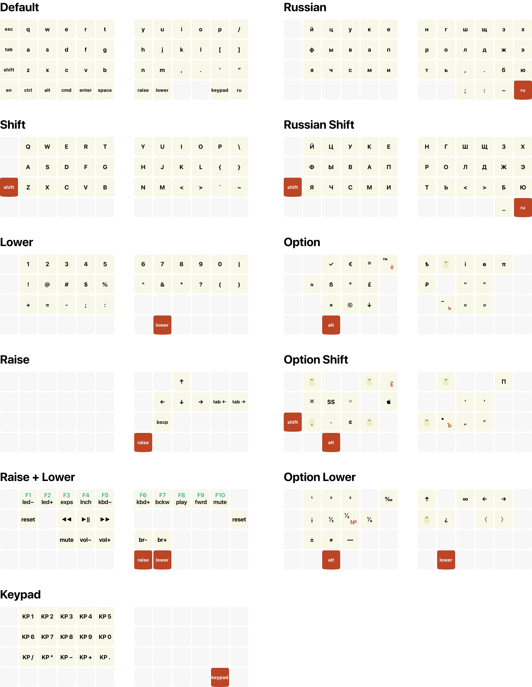
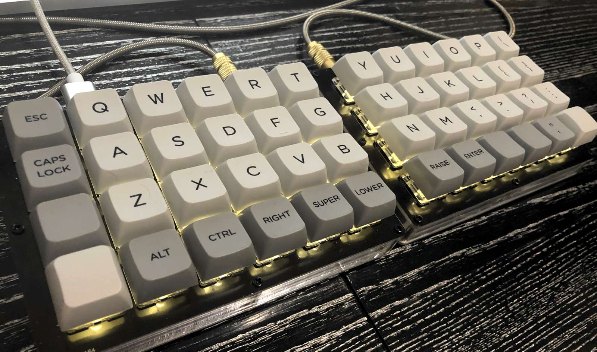

# Keymap & EN/RU layouts for Levinson 40% split keyboard



## Building keymap

Following [docs.qmk.fm/#/newbs_getting_started](https://docs.qmk.fm/#/newbs_getting_started):

```
brew tap qmk/qmk
brew install qmk
qmk setup
```

Then

```
cd ~/work
git clone git@github.com:tonsky/Levinson-Layout.git
ln -s ~/work/Levinson-Layout/keymap ~/qmk_firmware/keyboars/keebio/levinson/keymaps/tonsky
qmk compile -kb keebio/levinson/rev2 -km tonsky
```

Download `QMK Toolbox.app`
[https://github.com/qmk/qmk_toolbox/releases](https://github.com/qmk/qmk_toolbox/releases).

Local file: `~/qmk_firmware/keebio_levinson_rev2_tonsky.hex`
Auto-flash: checked
Press `Raise` + `Lower` + `A` (`RESET`)

## Layout

Layout and keymap work together to put keys where I want them, when possible. This is EN/RU layout, which led to some compromises.

- `EN` sends F17, `RU` sends F18.
- Alt layout mostly compatible with [Ilya Birman Typography Layout](https://ilyabirman.ru/projects/typography-layout/).
- Some of the principles from [github.com/tonsky/Universal-Layout](https://github.com/tonsky/Universal-Layout) apply.
- Navigation arrows do not require Karabiner.

## The physical device



NOTE: Not all caps match their actual function :) Consult cheatsheet above for the truth.

## Where to buy

[keeb.io/products/levinson-lets-split-w-led-backlight](https://keeb.io/products/levinson-lets-split-w-led-backlight)